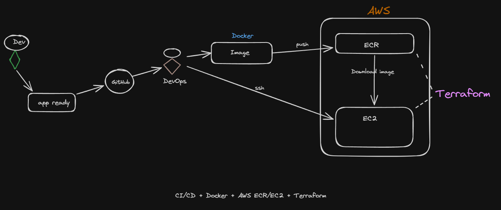

# DevOps Portfolio

Hello!😊
My name is Agnelo Silva Baia. I studied Computer Engineering at ISEC Coimbra and during my internship (25/26) I worked on automation and CI/CD for cloud-based 5G systems. Since then, I've been expanding my DevOps skills. 

This repository showcases my hands-on infrastructure and automation projects, built incrementally to practice the core DevOps toolchain: containerization, Infrastructure as Code, and CI/CD.

Each folder is a self-contained project with its own `README.md` covering the goal, the architecture, how to run it, and the design decisions behind it.

## Projects



| # | Project | Focus | Stack |
|---|---|---|---|
| 01 | [Dockerized Static Website](./01-docker-static-website) | Containerizing a static site behind Nginx | Docker, Nginx |
| 02 | [Terraform AWS Infrastructure](./02-terraform-aws-infra) | Provisioning EC2, Security Groups and ECR with Terraform, remote state on S3 | Terraform, AWS (EC2, ECR, S3, IAM), Docker |
| 03 | CI/CD Pipeline *(in progress)* | Automated build → push to ECR → deploy to EC2 | GitHub Actions |

## Why this repo exists

This is a working portfolio, not a tutorial copy-paste. Every project here was built, broken, debugged and fixed by hand — including the mistakes. Project 02's README links to a detailed engineering log documenting real errors encountered while provisioning AWS infrastructure (HCL syntax pitfalls, region/VPC mismatches, SSH key permission issues) and how each was diagnosed and resolved. That process — not just the final `terraform apply` — is the point.

## Roadmap

- [x] Containerize a static website with Docker
- [x] Provision AWS infrastructure (EC2 + Security Group + ECR) with Terraform and a remote S3 backend
- [ ] Move hardcoded values (AMI, VPC ID, region) into `variables.tf` with sensible defaults
- [ ] Add a CI/CD pipeline: build the image, push to ECR, deploy to EC2 on every merge to `main`
- [ ] Add monitoring/logging (CloudWatch)

## Tech stack

`Docker` · `Terraform` · `AWS (EC2, ECR, S3, IAM, VPC)` · `Nginx` · `Linux` · `Git`

## Running locally

Each project folder has its own setup instructions. In general:

```bash
git clone https://github.com/<your-username>/<repo-name>.git
cd <repo-name>/01-docker-static-website   # or 02-terraform-aws-infra
```

Then follow that project's `README.md`.

## About

Built while studying DevOps.

[LinkedIn](www.linkedin.com/in/agnelo-silva-baia) · [Email](mailto:aguinelobaia@gmail.com)
