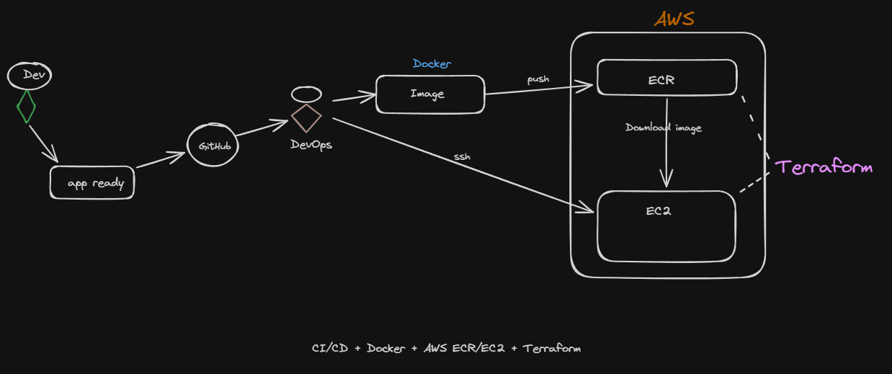

# DevOps Portfolio

Hello
My name is Agnelo Silva Baia. I studied Computer Engineering at ISEC Coimbra and during my internship (25/26) I worked on Automation and CI/CD for cloud-based 5G systems. Since then, I've been expanding my DevOps skills. 

This repository showcases my hands-on infrastructure and automation projects, built incrementally to practice the core DevOps toolchain: containerization, Infrastructure as Code, and CI/CD.

Each folder is a self-contained project with its own `README.md` covering the goal, the architecture, how to run it, and the design decisions behind it.

## Projects

| # | Project | Focus | Stack |
|---|---|---|---|
| 01 | [Dockerized Static Website](./01-docker-static-website) | Containerizing a static site | Docker, Nginx |
| 02 | [Terraform AWS Infrastructure](./02-terraform-aws-infra) | Provisioning EC2, Security Groups and ECR with Terraform, remote state on S3 | Terraform, AWS (EC2, ECR, S3, IAM), Docker |
| 03 | [CI/CD Pipeline](./03-cicd-pipeline) | Automating Terraform operations through GitHub Actions | GitHub Actions, Terraform, OIDC, Checkov, TFLint |
| 04 | [CI/CD Pipeline](./04-automation-site-deploy) | Automated application build, image publishing and deployment to EC2 | GitHub Actions, Docker, ECR, EC2, SSH |

## DevOps Concepts Practiced

Throughout this portfolio, I worked with different parts of a typical DevOps workflow, from building containers and provisioning infrastructure to automating deployments.

The projects use **Docker** for containerization, including Dockerfiles, Nginx, image management and Amazon ECR. For infrastructure, I used **Terraform** to create and manage AWS resources such as EC2 instances, Security Groups, IAM roles and S3 remote state.

The CI/CD side is built with **GitHub Actions**. The pipelines automate tasks such as building Docker images, running Terraform, pushing images to ECR and deploying the application to an EC2 instance.

I also focused on some basic security practices throughout the projects. GitHub Actions uses **OIDC** to authenticate with AWS without storing long-lived access keys. EC2 uses an **IAM instance role** to access ECR, while Security Groups control network access. The infrastructure also uses **IMDSv2** and encrypted EBS volumes. Tools such as **Checkov** and **TFLint** are used to find security issues and configuration problems in the Terraform code.

Besides the main DevOps tools, I also had to work with **Linux, SSH, Docker on EC2 and network configuration**, including troubleshooting authentication problems and CI/CD pipeline failures.

### Security Approach

Security was considered as part of the development process rather than something added at the end.

For example, I used OIDC instead of storing AWS access keys in GitHub, IAM roles instead of credentials on the EC2 instance, and Security Groups to limit network access. I also enabled ECR image scanning, IMDSv2 and EBS encryption.

The projects also include tools such as **Checkov** and **TFLint** to help identify potential security and configuration issues.

I also document some of the security trade-offs and areas that could be improved, instead of presenting the projects as completely production-ready.

[LinkedIn](www.linkedin.com/in/agnelo-silva-baia) · [Email](mailto:aguinelobaia@gmail.com)
